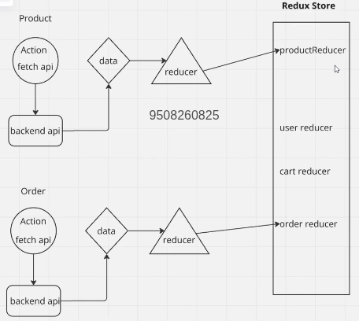

# My Notes

## React Fundamentals

React is a framework that allows me to build complex web applications like airbnb, HotStar.

### Components

React apps are made out of components. A component is a piece of the UI (user interface) that has its own logic and appearance. A component can be as small as a button, or as large as an entire page.

### JSX Files

`.jsx` files give me the facility to write HTML + JavaScript together.

- Inside curly braces, write your variable name.
- Using props, we pass value from parent component to child component using variable as props.

### State Management

**How we manage state and handle click:**

- I want as book ticket button clicked by someone, increase total booking count dynamically
- We use `useState` hook to manage state
- `useState` holds the data temporarily but not permanently. what recommenend idea is to handle state globally i.e use redux store and this store should be accessible from any components within that application.Inside store, we store the data that is coming from backend. for example we have one global staate where we are storing user data, orders data, product data.

**Redux**

redux is third party state management library used in production for react . Let's understand redux flow
reducer is plane object that holds the data which is coming from backend, that reducer will register with the store
create action.js file having all methods which can fetch data from backend

### Rendering Lists

How we can render list of movies from backend to UI using `map` function and keys will be in list.

### Routing

Learned to create multiple pages and how to navigate one page from another page using `react-router-dom`.

- Like if I am hovering on login, it should redirect to login page

### Form Handling in React

**Basic Form Handling:**

Learned how to use `handleChange` and `handleSubmit` while filling login form. One option is to create separate state for each field, but another option is to just use a single state.
under form tag, we wrap all inputs div

**Using Formik Library:**

Formik is a small group of React components and hooks for building forms in React. It helps with the three most annoying parts:

- Getting values in and out of form state
- Validation and error messages
- Handling form submission without you having to write `onChange` and `onSubmit` logic - Formik will do it easily

### useEffect

`useEffect` is a React hook used to perform side effects in function components. A side effect can be anything that interacts with something outside the component, like:

- Fetching data from an API/backend - we write logic for that inside `useEffect`
- Subscribing to a webSocket
- Manipulating the DOM
- Setting up event listeners  (setInterval, setTimer)

In React, after rendering all the UI, then `useEffect` will be invoked.
useEffect take  callback fxn as 1st parameter, 2nd parameter is dependency array (so whenever some state change, I want to invoke logic whatever write inside useEffect)

### Application Entry Point

Inside `index.js` we are rendering the whole app.

### Router Setup

If we want routes to be available for our whole application, we need to wrap the App component inside `BrowserRouter` and this `BrowserRouter` is coming from `react-router-dom`.

---

## Available Scripts

prerequistite tools :  VS code + node.js

```bash
npx react-create-app project_name
```

shortcut:

- for open new terminal : ctrl + shift + `(backtick)
- for open vs code : code .
- for create a component : type rafce then press enter

In the project directory, you can run:

### npm start : To start react application

Runs the app in the development mode.\
Open [http://localhost:3000](http://localhost:3000) to view it in your browser.

The page will reload when you make changes.\
You may also see any lint errors in the console.

## folder structure

- node_modules : contain all modules installed by react
- under public : have public files(images, logos)
- src : main folder where most time we work here (App.js is our main file, whatever changes we do here reflect on home page, App.test.js is for testing purpose(we don't need to touch it), index.css is global css )
- App.js component will render in index.js , if I want to wrap my application with provider, store, router , I need to add here.
- package.json contains all libraries or packages intsalled in react

command to install tailwindCss is this:

```bash
npm install -D tailwindcss
npx tailwindcss init
```

(this will create tailwind.config.js file)

command to install react router dom :

```bash
npm i react-router-dom
```

command to install formik :

```bash
npm i formik
```

command to setup redux :

```bash
npm i redux react-redux redux-thunk
```

react-redux act as bridge b/w react application and redux library, it helps to make connect
redux-thunk acts as middleware when we work with asynchronous
I just nedd to write classname no need to write plain css if I have tailwindcss

## point to be noted

- import componentName from path
- always write componentname with starting Capital letter
- we can create as many component as I want
- To know more about redux : Go here https://redux.js.org/

## Advanced concepts

- context API for state management
- custom hooks to abstract logic
- React router
  - setting up routes


